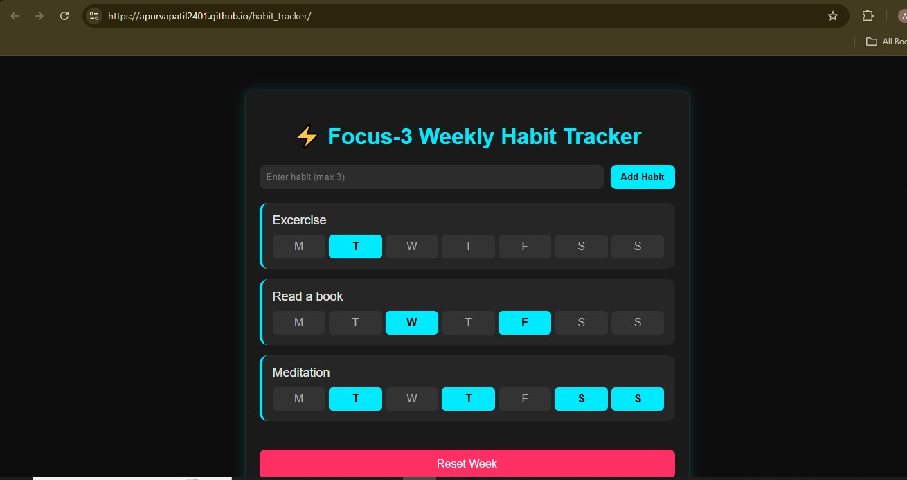

# Weekly Habit Tracker

A simple, clean, and fast weekly habit tracker that allows you to focus on your top 3 habits per week. No login, no signup — just open and track.
Built with HTML, CSS, JavaScript, and hosted on GitHub Pages.

🚀 Live Demo

🔗 https://apurvapatil2401.github.io/habit_tracker/

📂 Repository

🔗 https://github.com/ApurvaPatil2401/habit_tracker

🌟 Features
✔ Track up to 3 habits

Add your top 3 habits for the week to stay focused.

✔ 7-day progress tracking

Each habit includes daily checkboxes for Mon–Sun.

✔ Auto-save progress

All data is stored in localStorage, so nothing is lost when you refresh.

✔ Weekly reset

Clear all habits and start fresh with one click.

✔ Clean neon UI

Modern dark theme with glowing cyan + pink elements.

🛠️ Tech Stack
Component	Technology
Frontend	HTML, CSS, JavaScript
Storage	localStorage
Hosting	GitHub Pages
📸 Screenshots

(Add your screenshots here)

📌 Example:

📦 Project Structure
habit_tracker/
│
├── index.html
├── style.css
├── script.js
└── README.md

🧠 How It Works
1. Add a Habit

Enter a habit name (max 3 allowed).
The app stores it in localStorage.

2. Track Progress

Click M T W T F S S
Each click toggles the checkmark on/off.

3. Auto-Save

Progress is saved locally and restored automatically.

4. Reset Week

Clears all habits and daily states.
